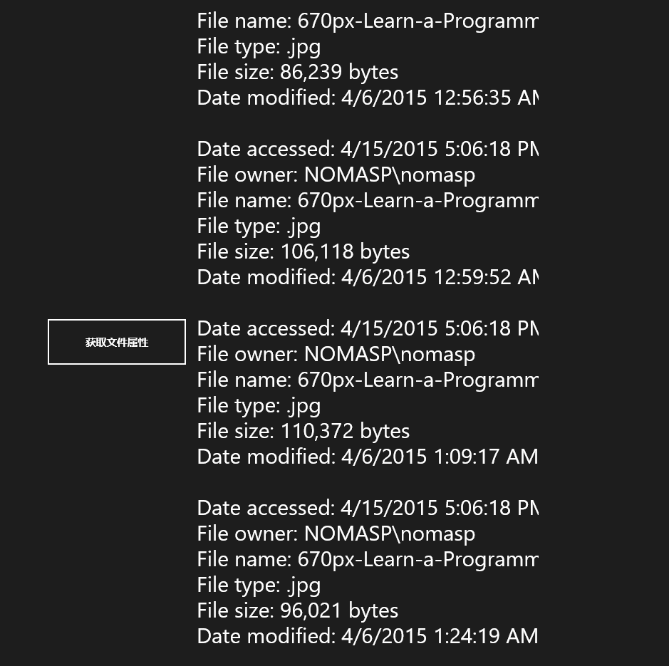
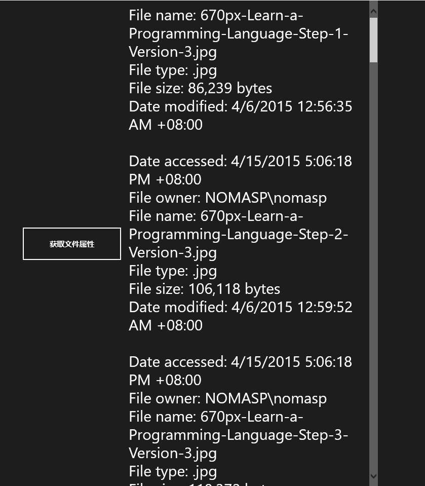

# 获取文件属性

这一节来看看获取文件属性吧，可以获取到文件名、类型、最近访问时间等等属性。

## 创建 Button 和 TextBlock

下面这段代码呢，都很简单。

```
 <Grid Background="{ThemeResource ApplicationPageBackgroundThemeBrush}">
        <StackPanel Orientation="Horizontal" HorizontalAlignment="Center" VerticalAlignment="Center">
            <Button Width="200" Height="70" Name="btnGetProp" Content="获取文件属性" Click="btnGetProp_Click"/>            
            <TextBlock Name="tBlockProp" Margin="12" Width="480" FontSize="30"/>          
        </StackPanel>
    </Grid>
</Page>
```

在 Click 事件中，先获取到图片库，当然了，你可以获取其他地方，我电脑上的库文件中，就只有文档库和图片库有文件了。然后创建一个文件查询，最后将这些文件都赋给 files。这里的 var 可谓是非常的强大啊。实例化一个 StringBuilder 对象来辅助输出信息那真是太完美不过了，我们在前面也常用到它。

```
var folder = KnownFolders.PicturesLibrary;
var fileQuery = folder.CreateFileQuery();
var files = await fileQuery.GetFilesAsync();
StringBuilder fileProperties = new StringBuilder();
for (int i = 0; i < files.Count; i++)
{
     StorageFile file = files[i];
     fileProperties.AppendLine("File name: " + file.Name);   
     fileProperties.AppendLine("File type: " + file.FileType);
     BasicProperties basicProperties = await file.GetBasicPropertiesAsync();
     string fileSize = string.Format("{0:n0}", basicProperties.Size);
     fileProperties.AppendLine("File size: " + fileSize + " bytes");
     fileProperties.AppendLine("Date modified: " + basicProperties.DateModified);
     fileProperties.AppendLine(" ");
}
tBlockProp.Text = fileProperties.ToString();
```

这样一来就完成对 Name、FileType、Size 和 DateModified 属性的获取，但还有一类属性，则比较难以获取，它们就是“扩展属性”。

```
List<string> propertiesName = new List<string>();
propertiesName.Add("System.DateAccessed");
propertiesName.Add("System.FileOwner");
IDictionary<string, object> extraProperties = await file.Properties.RetrievePropertiesAsync(propertiesName);
var propValue = extraProperties[dateAccessedProperty];
if (propValue != null)
     fileProperties.AppendLine("Date accessed: " + propValue);
propValue = extraProperties[fileOwnerProperty];
if (propValue != null)
     fileProperties.AppendLine("File owner: " + propValue);
```

最后将 fileProperties 传递给 TextBlock 即可。

```
tBlockProp.Text = fileProperties.ToString();
```

最后调试 App，就会像下图一样了。



但是如你所见，文件名太长了却无法自动换行，而且数据也显示不完整。改改 XAML 中的 TextBlock 即可。TextWrapping 属性设置为 Wrap，则可以换行；将 TextBlock 添加到 ScrollViewer 内则会显示出一个滚动条。

```
<Grid Background="{ThemeResource ApplicationPageBackgroundThemeBrush}">
        <StackPanel Orientation="Horizontal" HorizontalAlignment="Center" VerticalAlignment="Center">
            <Button Width="200" Height="70" Name="btnGetProp" Content="获取文件属性" Click="btnGetProp_Click"/>
            <ScrollViewer>
                <TextBlock Name="tBlockProp" Margin="12" Width="480" FontSize="30" TextWrapping="Wrap"/>
            </ScrollViewer>
        </StackPanel>
    </Grid>
```

