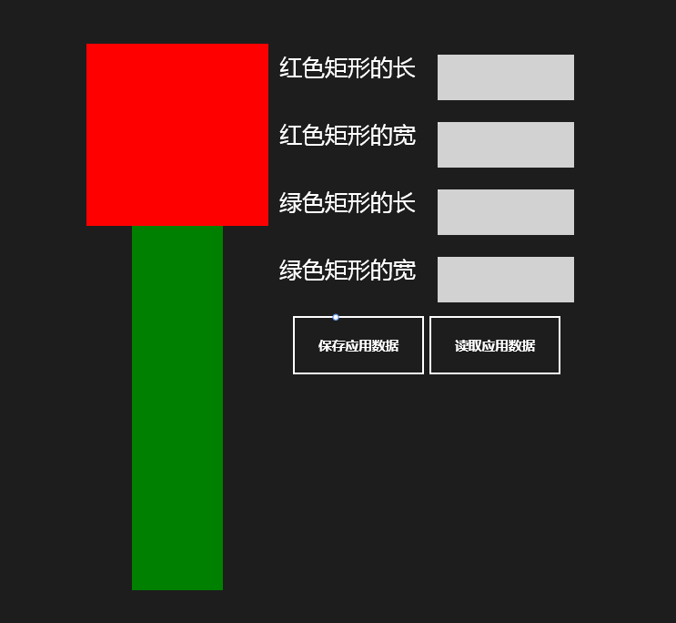
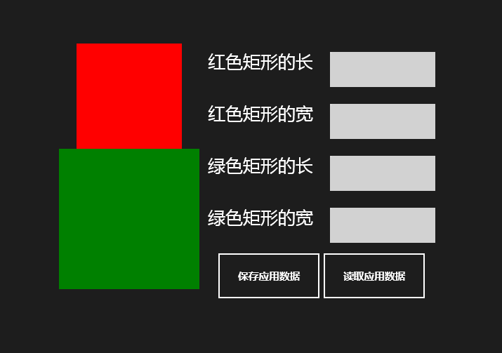
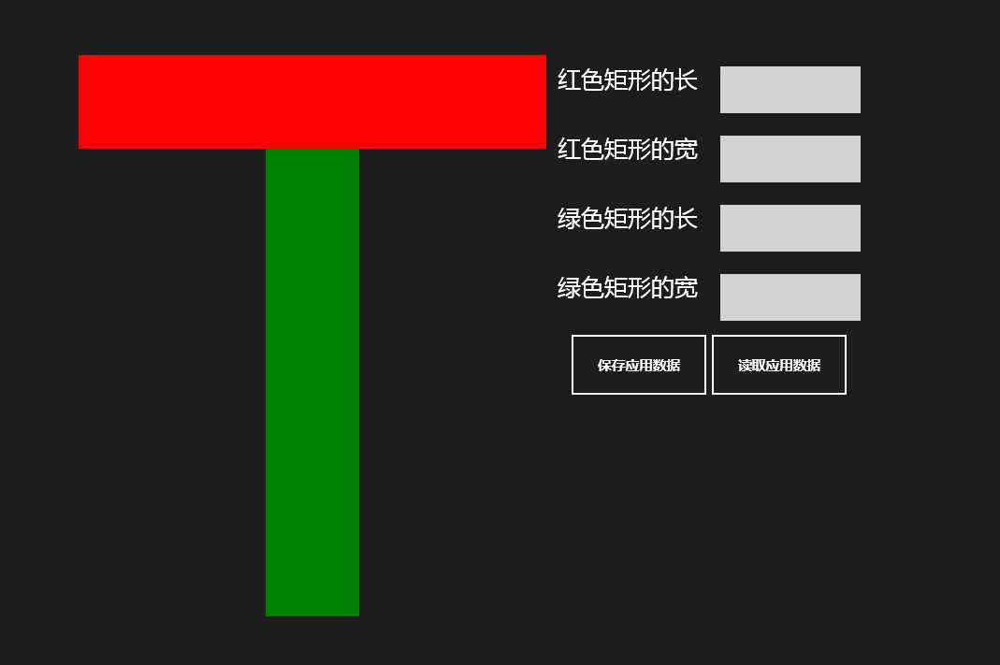

# 保存、读取、删除应用数据

在前面的几节中，都是关于数据的，这方面的内容其实还有很多很多，省略掉一部分后，也还是有很多。这一节是很重要的一部分，它关于如何保存和读取数据。

先来看看一个大概的背景吧，我这里写的很简单啦。



保存的内容就是这四个框框里填写的数据咯。先上 XAML 代码。

    <Grid Background="{ThemeResource ApplicationPageBackgroundThemeBrush}">
    <StackPanel Orientation="Horizontal" HorizontalAlignment="Center" VerticalAlignment="Center">
    <StackPanel Orientation="Vertical">
    <Rectangle Name="recRed" Width="200" Height="200" Fill="Red"/>
    <Rectangle Name="recGreen" Width="100" Height="400" Fill="Green"/>
    </StackPanel>
    <StackPanel Orientation="Vertical">
    <StackPanel Orientation="Horizontal">
    <StackPanel Orientation="Vertical">
    <TextBlock Text="红色矩形的长" FontSize="25" Margin="12" Width="150" Height="50" />
    <TextBlock Text="红色矩形的宽" FontSize="25" Margin="12" Width="150" Height="50" />
    <TextBlock Text="绿色矩形的长" FontSize="25" Margin="12" Width="150" Height="50" />
    <TextBlock Text="绿色矩形的宽" FontSize="25" Margin="12" Width="150" Height="50"  />
    </StackPanel>
    <StackPanel Orientation="Vertical">
    <TextBox Name="tBoxRedHeight" FontSize="25" Width="150" Height="50" Margin="12"/>
    <TextBox Name="tBoxRedWidth" FontSize="25" Width="150" Height="50"  Margin="12"/>
    <TextBox Name="tBoxGreenHeight" FontSize="25" Width="150" Height="50"  Margin="12" />
    <TextBox Name="tBoxGreenWidth" FontSize="25" Width="150" Height="50"  Margin="12" />
    </StackPanel>
    </StackPanel>
    <StackPanel Orientation="Horizontal" HorizontalAlignment="Center" VerticalAlignment="Center">
    <Button Width="150" Height="70" Name="btnSaveAppData" Click="btnSaveAppData_Click" Content="保存应用数据"/>
    <Button Width="150" Height="70" Name="btnReadAppData" Click="btnReadAppData_Click" Content="读取应用数据"/>
    </StackPanel>
    </StackPanel>
    </StackPanel>  
    </Grid>

## 单个设置

先来看看单个设置呗，下面就是代码咯。

```
Windows.Storage.ApplicationDataContainer localSettings = Windows.Storage.ApplicationData.Current.LocalSettings;
Windows.Storage.StorageFolder localFolder = Windows.Storage.ApplicationData.Current.LocalFolder;
public MainPage()
{
     this.InitializeComponent();
}
private void btnSaveAppData_Click(object sender, RoutedEventArgs e)
{                              
    localSettings.Values["RectangleRedHeight"] = tBoxRedHeight.Text;
    localSettings.Values["RectangleRedWidth"] = tBoxRedWidth.Text;
    localSettings.Values["RectangleGreenHeight"] = tBoxGreenHeight.Text;
    localSettings.Values["RectangleGreenWidth"] = tBoxGreenWidth.Text;
}
private void btnReadAppData_Click(object sender, RoutedEventArgs e)
{
     Object objRectangleRedHeight = localSettings.Values["RectangleRedHeight"];
     Object objRectangleRedWidth = localSettings.Values["RectangleRedWidth"];
     Object objRectangleGreenHeight = localSettings.Values["RectangleGreenHeight"];
     Object objRectangleGreenWidth = localSettings.Values["RectangleGreenWidth"];
     recRed.Height = double.Parse(objRectangleRedHeight.ToString());  
     recRed.Width = double.Parse(objRectangleRedWidth.ToString());          
     recGreen.Height = double.Parse(objRectangleGreenHeight.ToString());
     recGreen.Width = double.Parse(objRectangleGreenWidth.ToString());            
}
```

首先定义了两个全局变量，如果看过前面几篇文章，这个应该就非常清楚了。顾名思义，第一个是用来保存本地设置的，第二个则是用来访问本地文件夹的。这里是单个设置地进行保存的，后面还有 2 种方式。那么就来调试吧，注意在点击了保存数据按钮之后把 App 关掉哦，关掉之后再加载，这样才算是保存了应用数据嘛，你说对不对呢？

以下就是我的测试结果了。



## 复合设置

我们的设计都不用变，后台代码修改如下。

```
Windows.Storage.ApplicationDataContainer localSettings = Windows.Storage.ApplicationData.Current.LocalSettings;
Windows.Storage.StorageFolder localFolder = Windows.Storage.ApplicationData.Current.LocalFolder;
  public MainPage()
    {
      this.InitializeComponent();
    }
 private void btnSaveAppData_Click(object sender, RoutedEventArgs e)
    {
      Windows.Storage.ApplicationDataCompositeValue compositeSettings = new ApplicationDataCompositeValue();
      compositeSettings["RectangleRedHeight"] = tBoxRedHeight.Text;
      compositeSettings["RectangleRedWidth"] = tBoxRedWidth.Text;
      compositeSettings["RectangleGreenHeight"] = tBoxGreenHeight.Text;
      compositeSettings["RectangleGreenWidth"] = tBoxGreenWidth.Text;               
      localSettings.Values["RectangleSettings"] = compositeSettings;     
    }
 private async void btnReadAppData_Click(object sender, RoutedEventArgs e)
    {
      Windows.Storage.ApplicationDataCompositeValue compositeSettings =  
        (Windows.Storage.ApplicationDataCompositeValue)localSettings.Values["RectangleSettings"];
      if (compositeSettings == null)
        {
          Windows.UI.Popups.MessageDialog messageDialog =   
          new Windows.UI.Popups.MessageDialog("你好像没有保存任何应用数据哦！");
          await messageDialog.ShowAsync();
        }
      else
        {
          recRed.Height = double.Parse(compositeSettings["RectangleRedHeight"].ToString());
          recRed.Width = double.Parse(compositeSettings["RectangleRedWidth"].ToString());
          recGreen.Height = double.Parse(compositeSettings["RectangleGreenHeight"].ToString());
          recGreen.Width = double.Parse(compositeSettings["RectangleGreenWidth"].ToString());                 
        }  
    }
```

使用 ApplicationDataCompositeValue 会创建一个复合设置，通过代码所示方式即可添加数据，最后会将其添加到 localSettings中。

读取数据的时候，同样是先在 localSettings 中通过键值对的方式来取出这个复合设置。如果该设置为空，就会调用 MessageDialog 控件弹窗通知没有保存数据。对于这个控件，可以访问这里：[【万里征程——Windows App开发】控件大集合2](http://blog.csdn.net/nomasp/article/details/44781145)。如果复合设置存在则将他们分别进行类型转换后复制给相应的矩形的属性。

## 在容器中存放数据

在容器存放数据其实也就这么回事啦，无非就是先创建一个容器，然后如果创建成功了，就在其中添加相应的数据即可。

至于加载数据，在这里我使用了一个 bool 变量来检查容器是不是已经创建好了，如果创建好了就可以将相应的数据取出然后赋值了，如果没有的话则一样挑出弹窗。

```
Windows.Storage.ApplicationDataContainer localSettings = Windows.Storage.ApplicationData.Current.LocalSettings;
Windows.Storage.StorageFolder localFolder = Windows.Storage.ApplicationData.Current.LocalFolder;
  public MainPage()
    {
      this.InitializeComponent();
    }
  private void btnSaveAppData_Click(object sender, RoutedEventArgs e)
    {    
      Windows.Storage.ApplicationDataContainer containerSettings =
      localSettings.CreateContainer("RecSettingsContainer", Windows.Storage.ApplicationDataCreateDisposition.Always);
    if (localSettings.Containers.ContainsKey("RecSettingsContainer"))
      {
        localSettings.Containers["RecSettingsContainer"].Values["RectangleRedHeight"] = tBoxRedHeight.Text;
        localSettings.Containers["RecSettingsContainer"].Values["RectangleRedWidth"] = tBoxRedWidth.Text;
        localSettings.Containers["RecSettingsContainer"].Values["RectangleGreenHeight"] = tBoxGreenHeight.Text;
        localSettings.Containers["RecSettingsContainer"].Values["RectangleGreenWidth"] = tBoxGreenWidth.Text;
       }
     }
  private async void btnReadAppData_Click(object sender, RoutedEventArgs e)
    {      
      bool hasContainerSettings = localSettings.Containers.ContainsKey("RecSettingsContainer");
    if(hasContainerSettings)
       {       
         recRed.Height = double.Parse(localSettings.Container  
         ["RecSettingsContainer"].Values["RectangleRedHeight"].ToString());
         recRed.Width = double.Parse(localSettings.Containers  
         ["RecSettingsContainer"].Values["RectangleRedWidth"].ToString());
         recGreen.Height = double.Parse(localSettings.Containers  
         ["RecSettingsContainer"].Values["RectangleGreenHeight"].ToString());
         recGreen.Width = double.Parse(localSettings.Containers  
         ["RecSettingsContainer"].Values["RectangleGreenWidth"].ToString());
       }
    else
       {
         Windows.UI.Popups.MessageDialog messageDialog =
         new Windows.UI.Popups.MessageDialog("你好像没有保存任何应用数据哦！");
         await messageDialog.ShowAsync();
        }         
      }
```

接下来就来个运行的截图咯，还有弹框的截图。




## 删除数据

1.对于单个设置和复合设置

```
localSettings.Values.Remove("compositeSettings");
```

2.对于复合数据

```
localSettings.DeleteContainer("containerSettings");
```

删除并不难，或者说，这一节都不难。有了这些，我们在做游戏的时候，就可以将用户对游戏的设置都保存下来啦。