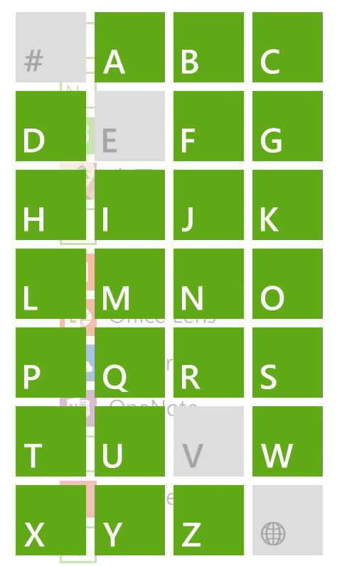
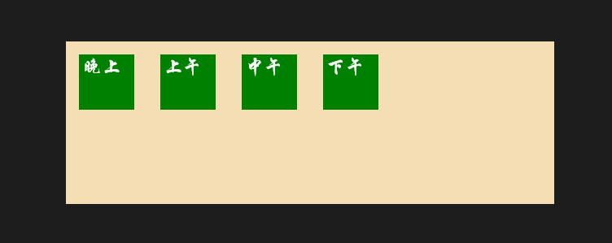
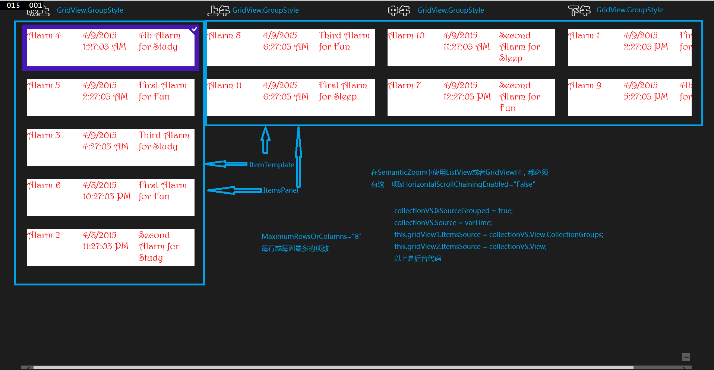

# 缩放视图 SemanticZoom

相信用过 Windows Phone 或者 Windows 8/8.1/10 的朋友对下面这张截图肯定不陌生。这就是通过 SemanticZoom 来实现的，当数据过多时，这种控件尤其适用。它有一个放大视图 ZoomedInView 和一个缩小试图 ZoomedOutView，前者主要用来显示当前页面的详细信息，后者则致力于快速导航。



那么我就自己来动手实践咯，首先我们在 XAML 中添加大致的界面，就像画画要先画轮廓一样。

```
<Grid Name="grid1" Background="{ThemeResource ApplicationPageBackgroundThemeBrush}">
        <SemanticZoom x:Name="semanticZoom" VerticalAlignment="Center" HorizontalAlignment="Center">   
            <SemanticZoom.ZoomedOutView>            
            </SemanticZoom.ZoomedOutView>
            <SemanticZoom.ZoomedInView>             
            </SemanticZoom.ZoomedInView>
        </SemanticZoom>
    </Grid>
```
然后分别在这两个视图中添加你想要加入的东西。这里的核心就是，ZoomedOutView 和 ZoomedInView 都是使用的同一个 CollectionViewSource 对象作为自己的数据集的。而这个属性我们在“为 ListView 和 GridView 分组”谈到过。

我们先把后台代码写好，我就像一篇那样装模作样写一个类吧。

```
    public class Alarm
    {
        public string Title { get; set; }
        public DateTime AlarmClockTime { get; set; }
        public string Description { get; set; }         
    }
```
然后用一个函数来添加一大堆数据……一大堆数据。

```
private Alarm[] AddAlarmData()
{
     return new Alarm[]
     {
          new Alarm {Title="Alarm 1",AlarmClockTime=globalTime.AddHours(17),Description="First Alarm for Study" },
          new Alarm {Title="Alarm 2",AlarmClockTime=globalTime.AddHours(2),Description="Second Alarm for Study" },
         new Alarm {Title="Alarm 3",AlarmClockTime=globalTime.AddHours(7),Description="Third Alarm for Study" },
         new Alarm {Title="Alarm 4",AlarmClockTime=globalTime.AddHours(4),Description="4th Alarm for Study" },
         new Alarm {Title="Alarm 5",AlarmClockTime=globalTime.AddHours(5),Description="First Alarm for Fun" },
         new Alarm {Title="Alarm 6",AlarmClockTime=globalTime.AddHours(1),Description="First Alarm for Fun" },
         new Alarm {Title="Alarm 7",AlarmClockTime=globalTime.AddHours(15),Description="Second Alarm for Fun" },
         new Alarm {Title="Alarm 8",AlarmClockTime=globalTime.AddHours(9),Description="Third Alarm for Fun" },
         new Alarm {Title="Alarm 9",AlarmClockTime=globalTime.AddHours(20),Description="4th Alarm for Fun" },
         new Alarm {Title="Alarm 10",AlarmClockTime=globalTime.AddHours(14),Description="Second Alarm for Sleep" },
         new Alarm {Title="Alarm 11",AlarmClockTime=globalTime.AddHours(9),Description="First Alarm for Sleep" }
     };
}
```

因为我们最后要把放大视图变成缩小视图，记得缩小视图上面有一些 ABCD 之类的字母么，这里我们用的是时间，就分成中午晚上等好啦。就通过下面这样的一个函数来搞定。其用了一个键值对，用 time 作为参数。后面再将这些数据筛选出来，绑定到新添加的 CollectionViewSource 中。至于 gridView1 和 gridView2 是即将添加到 XAML 中，这里可以先不填，一回再补上。

```
Func<int, string> SwitchTime = (time) =>
{
    if (time <= 10 && time >= 6)
         return "上午";
    else if (time > 10 && time < 14)
         return "中午";
    else if (time >= 14 && time <= 20)
         return "下午";
    else
         return "晚上";      
};
var varTime = from t in AddAlarmData()
              orderby t.AlarmClockTime.Hour
              group t by SwitchTime(t.AlarmClockTime.Hour);
CollectionViewSource collectionVS = new CollectionViewSource();
collectionVS.IsSourceGrouped = true;
collectionVS.Source = varTime;
this.gridView1.ItemsSource = collectionVS.View.CollectionGroups;
this.gridView2.ItemsSource = collectionVS.View;
```

我们先来写主视图（也就是放大视图）。

    <GridView x:Name="gridView2" IsSwipeEnabled="True" HorizontalAlignment="Center"   
     VerticalAlignment="Center" ScrollViewer.IsHorizontalScrollChainingEnabled="False"  
     Width="1800" Height="1000">
     <GridView.ItemTemplate>
     <DataTemplate>
     <StackPanel Orientation="Horizontal" Margin="12" HorizontalAlignment="Left" Background="White">
      <TextBlock Text="{Binding Title}" TextWrapping="Wrap" Foreground="Red"  
      FontFamily="Harrington" Width="150" Height="100" FontSize="26" FontWeight="Light"/>
      <TextBlock Text="{Binding AlarmClockTime}"  Foreground="Red" TextWrapping="Wrap"  
      Width="150"  Height="100"  FontFamily="Harrington" FontSize="26" FontWeight="Light"/>
      <TextBlock Text="{Binding Description}"  Foreground="Red" TextWrapping="Wrap"  
      Width="150"  Height="100"  FontFamily="Harrington" FontSize="26" FontWeight="Light"/>
      </StackPanel>
      </DataTemplate>
      </GridView.ItemTemplate>
      <GridView.ItemsPanel>
       <ItemsPanelTemplate>
    <ItemsWrapGrid MaximumRowsOrColumns="8"/>
       </ItemsPanelTemplate>
      </GridView.ItemsPanel>
      <GridView.GroupStyle>
       <GroupStyle>
     <GroupStyle.HeaderTemplate>
      <DataTemplate>
       <TextBlock Text='{Binding Key}' Foreground="{StaticResource  
      ApplicationForegroundThemeBrush}" Margin="12" FontSize="30" FontFamily="华文彩云"  
       FontWeight="ExtraBold" />
      </DataTemplate>
     </GroupStyle.HeaderTemplate>
    </GroupStyle>
      </GridView.GroupStyle>
    </GridView>

相信大家都能看得懂，另外稍后我会在截图中添加一些注释的哦。然后是缩小视图。

    <GridView Name="gridView1" Background="Wheat"  
    ScrollViewer.IsHorizontalScrollChainingEnabled="False" HorizontalAlignment="Center"  
    VerticalAlignment="Center" Width="600" Height="200">
    <GridView.ItemTemplate>
    <DataTemplate>
    <TextBlock Width="100" Height="100" Text="{Binding Group.Key}" FontFamily="华文行楷"  
    FontWeight="Normal" FontSize="24" />
     </DataTemplate>
    </GridView.ItemTemplate>
    <GridView.ItemsPanel>
     <ItemsPanelTemplate>
      <ItemsWrapGrid ItemWidth="100" ItemHeight="100" MaximumRowsOrColumns="2"/>
      </ItemsPanelTemplate>
     </GridView.ItemsPanel>
     <GridView.ItemContainerStyle>
      <Style TargetType="GridViewItem">
      <Setter Property="Margin" Value="12" />
      <Setter Property="Padding" Value="3" />
      <Setter Property="BorderThickness" Value="1" />
      <Setter Property="Background" Value="Green"/>
      </Style>
     </GridView.ItemContainerStyle>
    </GridView>

那么代码就到这里为止了，接下来自然就是截图了。





（这种图片如果看不清的话可以保存到电脑上再看。）

想了解字体相关的信息，可以看第九章的“使用更多字体”。