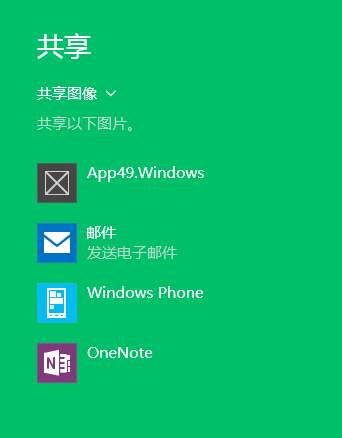
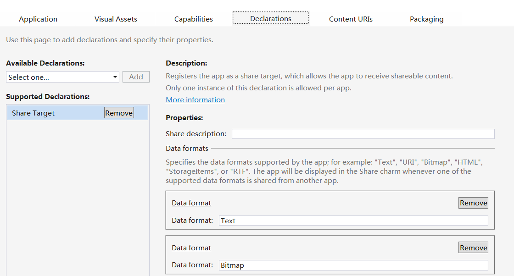
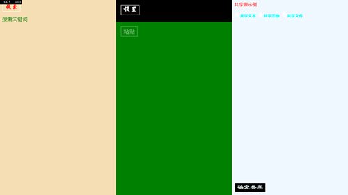
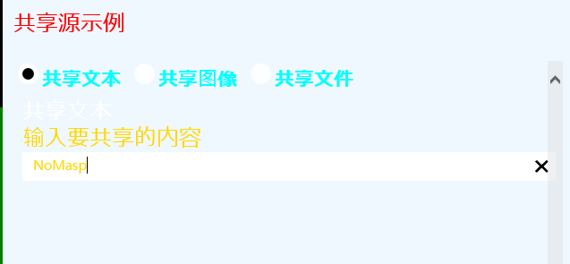
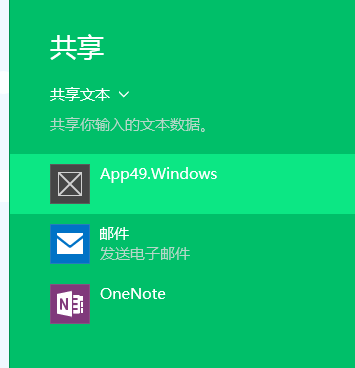
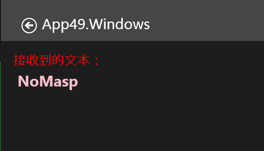
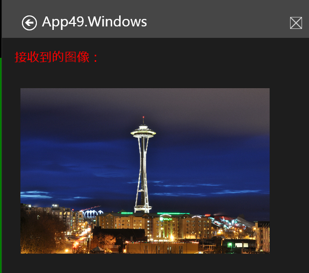
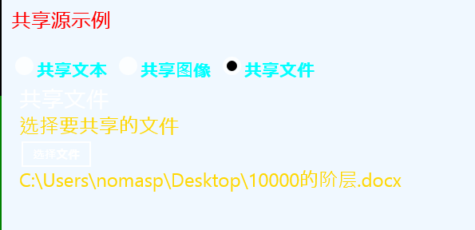
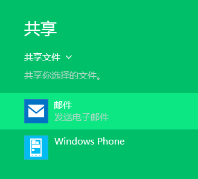
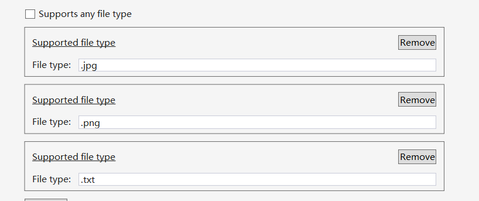

# 设置共享（共享源和共享目标）

上一节简单介绍了通过粘贴板来共享数据，这一节将会添加更为强大的功能哦。

以下就是大概的样式了，随便看看就好了，这都不是重点。

```
<Grid Background="AliceBlue">
<Grid.RowDefinitions>
<RowDefinition Height="auto"/>
<RowDefinition />
<RowDefinition Height="auto"/>
</Grid.RowDefinitions>
<TextBlock Grid.Row="0" FontSize="25"  Foreground="Red" Text="共享源示例"  Margin="12"/>
<ScrollViewer Grid.Row="1" Margin="14" VerticalScrollMode="Auto" HorizontalScrollMode="Disabled">
<StackPanel>
<StackPanel Orientation="Horizontal"> 
<RadioButton x:Name="radioBtnText" Foreground="Aqua" FontWeight="Bold" FontSize="22"  
Content="共享文本" Checked="OnChecked" GroupName="g" Tag="text"/>
<RadioButton x:Name="radioBtnImg"  Foreground="Aqua" FontWeight="Bold" FontSize="22"  
Content="共享图像" Margin="12,0,0,0" Checked="OnChecked" GroupName="g" Tag="image"/>
<RadioButton x:Name="radioBtnFile"  Foreground="Aqua" FontWeight="Bold" FontSize="22"  
Content="共享文件" Margin="12,0,0,0" Checked="OnChecked" GroupName="g" Tag="file"/>
</StackPanel>
<StackPanel Name="stackPText" Visibility="Collapsed" Margin="8">
<TextBlock Text="共享文本" FontSize="25"/>
<TextBlock Foreground="Gold" FontSize="25" Text="输入要共享的内容" />
<TextBox x:Name="tBlockText" Foreground="Gold" />
</StackPanel>
<StackPanel Name="stackPImg" Visibility="Collapsed" Margin="8">
<TextBlock Text="共享图像" FontSize="25"/>
<TextBlock Foreground="Gold" FontSize="25" Text="共享以下图片"/>
<Image Width="600" Height="400" Stretch="UniformToFill" HorizontalAlignment="Left" 
Margin="1,5,0,5" Source="Assets/SpaceNeedle1.jpg"/>
</StackPanel>
<StackPanel Name="stackPFile" Visibility="Collapsed" Margin="8">
<TextBlock Text="共享文件" FontSize="28"/>
<TextBlock Foreground="Gold" FontSize="25" Text="选择要共享的文件"/>
<StackPanel>
<Button Content="选择文件" Click="OnPickFile"/>
<TextBlock x:Name="tBlockFile" Foreground="Gold" FontSize="24"/>
</StackPanel>
</StackPanel> 
</StackPanel> 
</ScrollViewer> 
<Button Grid.Row="2" Name="btnShare" Margin="12" Content="确定共享" FontSize="35"  
FontFamily="隶书" Foreground="Azure" Background="Black" Click="btnShare_Click"/>
</Grid>
```

这里通过 3 个 StackPanel 的“显示“与”隐藏“来达到在一个位置显示 3 个界面的功能，然后在后台通过以下方法更改 Visibility 属性。

```
	    private void OnChecked(object sender, RoutedEventArgs e)
        {
            RadioButton rbtn = sender as RadioButton;
            if (rbtn != null)
            {            
                string tag = rbtn.Tag.ToString();
                switch (tag)
                {
                    case "text":
                        this.stackPText.Visibility = Windows.UI.Xaml.Visibility.Visible;
                        this.stackPImg.Visibility = Windows.UI.Xaml.Visibility.Collapsed;
                        this.stackPFile.Visibility = Windows.UI.Xaml.Visibility.Collapsed;
                        break;
                    case "image":
                        this.stackPText.Visibility = Windows.UI.Xaml.Visibility.Collapsed;
                        this.stackPImg.Visibility = Windows.UI.Xaml.Visibility.Visible;
                        this.stackPFile.Visibility = Windows.UI.Xaml.Visibility.Collapsed;
                        break;
                    case "file":
                        this.stackPText.Visibility = Windows.UI.Xaml.Visibility.Collapsed;
                        this.stackPImg.Visibility = Windows.UI.Xaml.Visibility.Collapsed;
                        this.stackPFile.Visibility = Windows.UI.Xaml.Visibility.Visible;
                        break;
                    default:
                        this.stackPText.Visibility = Windows.UI.Xaml.Visibility.Visible;
                        this.stackPImg.Visibility = Windows.UI.Xaml.Visibility.Collapsed;
                        this.stackPFile.Visibility = Windows.UI.Xaml.Visibility.Collapsed;
                        break;
                }
            }
        }
```

以下是核心代码，通过 RadioButton 的选择来共享不同的内容。这里没有进行 try、catch 异常检测，但在实际工程中则是必要的，因为如果你不共享任何内容而点击共享按钮你就知道了……

```
void MainPage_DataRequested(DataTransferManager sender, DataRequestedEventArgs args)
   {                       
     var deferral = args.Request.GetDeferral();
     if (radioBtnText.IsChecked == true) 
       {
         args.Request.Data.Properties.Title = "共享文本";
         args.Request.Data.Properties.Description = "共享你输入的文本数据。";
         args.Request.Data.SetText(this.tBlockText.Text);
       }
     else if (radioBtnImg.IsChecked == true)
       {
         args.Request.Data.Properties.Title = "共享图像";
         args.Request.Data.Properties.Description = "共享以下图片。";
         args.Request.Data.SetBitmap(Windows.Storage.Streams.RandomAccessStreamReference.CreateFromUri  
         (new Uri("ms-appx:///Assets/SpaceNeedle1.jpg")));
        }
      else if (radioBtnFile.IsChecked == true)
        {
          args.Request.Data.Properties.Title = "共享文件";
          args.Request.Data.Properties.Description = "共享你选择的文件。";          
          var file = this.tBlockFile.Tag as Windows.Storage.StorageFile;
          List<IStorageItem> files = new List<IStorageItem>();
          files.Add(file);
          args.Request.Data.SetStorageItems(files);
        }               
      deferral.Complete();
    }
```

选择文件的方法我们在前面也都介绍过了，直接贴代码……

```
		 private async void OnPickFile(object sender, RoutedEventArgs e)
        {                         
            Windows.Storage.Pickers.FileOpenPicker picker = new Windows.Storage.Pickers.FileOpenPicker();
            picker.FileTypeFilter.Add(".mp3");
            picker.FileTypeFilter.Add(".jpg");
            picker.FileTypeFilter.Add(".png");
            picker.FileTypeFilter.Add(".docx");
            picker.FileTypeFilter.Add(".pptx");
            picker.FileTypeFilter.Add(".txt");
            Windows.Storage.StorageFile file = await picker.PickSingleFileAsync();
            if (file != null)
            {
                this.tBlockFile.Text = file.Path;                   
                this.tBlockFile.Tag = file;
            }
        }
```

当然了，记得下面这些操作……

```
	   protected override void OnNavigatedTo(NavigationEventArgs e)
        {
			DataTransferManager.GetForCurrentView().DataRequested += MainPage_DataRequested;
        }
        protected override void OnNavigatedFrom(NavigationEventArgs e)
        {
            DataTransferManager.GetForCurrentView().DataRequested -= MainPage_DataRequested;
        }
```
最后就是共享确认按钮了，一行代码搞定。

```
		private void btnShare_Click(object sender, RoutedEventArgs e)
        {
            DataTransferManager.ShowShareUI();
        }
```
以上这个 App，你将需要共享的数据从这里发出，也叫共享源，但共享到哪里了呢？



看到”共享图像“和”共享以下图片“想起来刚才的两行代码了么？这两个属性就用在了这里。

```
args.Request.Data.Properties.Title = "共享文本";
args.Request.Data.Properties.Description = "共享你输入的文本数据。";
```

我们当然可以将数据共享到邮件、OneNote 里，但如果你是要写一个自己的接收共享数据的应用呢，如何来写？

接下来就来写另一个 App 咯，也就是上图中的 App49 了。首先在清单文件中做如下操作，当然了，具体要添加哪些东西大家自己看着办就好了。




然后添加一个 XAML 页面来接收数据，因为你不可能只让你的 APP 专门用来接收数据咯，所以就不建议在 MainPage 中写了。

在新页面中大概做一下页面布局，我的布局通常来说都不是很美观的……

```
	<Grid Background="{StaticResource ApplicationPageBackgroundThemeBrush}">
        <Grid.RowDefinitions>
            <RowDefinition Height="*"/>
            <RowDefinition Height="100"/>
        </Grid.RowDefinitions>        
        <Grid x:Name="gridText" Margin="24" Visibility="Collapsed" Grid.Row="0">
            <StackPanel>
                <TextBlock FontSize="25" Foreground="Red" Text="接收到的文本："/>
                <TextBlock FontSize="30" Foreground="Pink" FontWeight="Bold" x:Name="tbText" Margin="8"/>
            </StackPanel>
        </Grid>        
        <Grid x:Name="gridImg" Margin="25" Visibility="Collapsed" Grid.Row="0">
            <StackPanel>
                <TextBlock FontSize="25" Foreground="Red" Text="接收到的图像："/>
                <Image x:Name="img" Margin="12" Width="500" Height="400" HorizontalAlignment="Left" Stretch="Uniform"/>
            </StackPanel>
        </Grid>       
        <Grid x:Name="gridStorageItems" Margin="25" Visibility="Collapsed" Grid.Row="0">
            <StackPanel>
                <TextBlock FontSize="25"  Foreground="Red" Text="接收到的文件："/>
                <TextBlock FontSize="30" Margin="12" x:Name="tbStorageItem"/>
            </StackPanel>
        </Grid>        
        <Button Grid.Row="1" HorizontalAlignment="Center" Margin="0,15,0,20" 
                Content="完成共享" FontSize="28" Width="200" Click="btnCompleteShare_Click"/>
    </Grid>
```

后台代码中写以下代码，核心在于 if 中的 3 个判断，就是 3 中共享的文件了咯。

```
  public sealed partial class ShareTargetPage : Page
    {
        ShareOperation shareOperation = null;
        public ShareTargetPage()
        {
            this.InitializeComponent();
        }
        protected async override void OnNavigatedTo(NavigationEventArgs e)
        {
            ShareOperation sp = e.Parameter as ShareOperation;
            if (sp != null)
            {
                this.shareOperation = sp;
                DataPackageView pack = sp.Data;
                if (pack.Contains(StandardDataFormats.Text))
                {                                             
                    string s = await pack.GetTextAsync();
                    this.tbText.Text = s;
                    this.gridText.Visibility = Windows.UI.Xaml.Visibility.Visible;
                }
                else if (pack.Contains(StandardDataFormats.Bitmap))
                {                                       
                    var stream = await pack.GetBitmapAsync();
                    BitmapImage bmp = new BitmapImage();
                    bmp.SetSource(await stream.OpenReadAsync());
                    this.img.Source = bmp;
                    this.gridImg.Visibility = Windows.UI.Xaml.Visibility.Visible;
                }
                else if (pack.Contains(StandardDataFormats.StorageItems))
                {                                                
                    var storageItems = await pack.GetStorageItemsAsync();
                    StorageFile file = storageItems[0] as StorageFile;
                    this.tbStorageItem.Text = file.Name;
                    this.gridStorageItems.Visibility = Windows.UI.Xaml.Visibility.Visible;
                }
            }
        }
        private void btnCompleteShare_Click(object sender, RoutedEventArgs e)
        {                         
            this.shareOperation.ReportCompleted();
        }
    }
```

接着我们就要来调试这两个程序啦。只需要将接受共享数据的 App 按 F5 运行后关掉就好了，因为它会部署到本地的，或者也可以在 Build 选项卡中直接部署也是一样的。然后按 F5 运行共享数据的数据源 App 就好啦。

截图如下：



这张图片我压缩过了，不如太大上传不了，所以可能看不清楚吧。下面是共享文本数据的过程截图啦。







这个是共享图像的截图，忘了说了，在前面的 SpaceNeedle1.jpg 就是下面这张图片我已经事先添加到工程里了的。



紧接着我们共享这个 docx 文件，却发现在共享栏里没有了 App49，发生了什么？





下面这首刚才添加的受支持的文件类型，明显没有添加 .docx，所以这也是一个需要注意的地方。



而想知道如何算出 10000 的阶层可以看[“100的阶层真的算不出来吗？”](http://blog.csdn.net/nomasp/article/details/45484979)