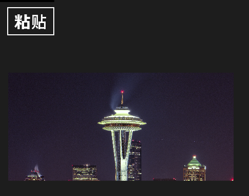

# 使用粘贴板

记得智能手机刚出来那会比较火的一个概念“能够复制粘贴的手机就是智能手机”。现在看来，这不过是个老掉牙的功能了，但实际用处却是非常强大的，那么现在我们就来试试怎么做到这个功能。

粘贴板的英文名叫做 Clipboard，这也是它的类名了。

新建工程这种就不说了，在 XAML 中代码如下：

```
<Grid Background="{StaticResource ApplicationPageBackgroundThemeBrush}">
<Grid Margin="12" HorizontalAlignment="Left" VerticalAlignment="Top" Width="500" Height="500">
<Grid.RowDefinitions>
<RowDefinition Height="Auto"/>
<RowDefinition Height="*"/>
</Grid.RowDefinitions>   
<Button Grid.Row="0" Name="btnClip" Margin="0,3,0,16" Content="粘贴" FontSize="32"  
Click="btnClip_Click"  IsEnabled="False"/>
<ScrollViewer Name="scrollView"  Grid.Row="1" Visibility="Collapsed">
<TextBlock Margin="12" Name="tBlockClipboard" FontSize="35" Foreground="Gainsboro" TextWrapping="Wrap" />
</ScrollViewer>
</Grid>
</Grid>
```

在后台代码中写上这么一个方法：

```
		void Clipboard_ContentChanged(object sender, object e)
        {
            DataPackageView pv = Clipboard.GetContent();
            if (pv.Contains(StandardDataFormats.Text))
            {
                btnClip.IsEnabled = true;
            }               
        }
```
StandardDataFormats 是标准数据格式，这里判断它是否是 Text，如果是的话则让前面的 Button 按钮可用（之前设为不可用，以灰色显示）。

标准数据格式有 Bitmap,HTML,RTF,StorageItems,Text,Uri 等。

然后在按钮的 Click 事件中写如下代码：

```
		private async void btnClip_Click(object sender, RoutedEventArgs e)
        {            
                var txt = await Clipboard.GetContent().GetTextAsync();
                tBlockClipboard.Text = txt;           
        }
```

这里我们使用了 Clipboard 类的 GetContent() 方法，用于在剪切板中取出 DataPackageView 对象数据；类似的还有 SetContent()，用于把数据存入剪切板中。还有 Clear 事件来清空剪切板，Flush 事件把数据从源写入到剪切板，并且在应用程序退出后依然保留在剪切板中。还有 ContentChanged 事件在剪切板中存储的数据内容发生变化时自动激活以达到监听剪切板内容变化的效果。

```
		protected override void OnNavigatedTo(NavigationEventArgs e)
        {
            Clipboard.ContentChanged += Clipboard_ContentChanged;
        }
        protected override void OnNavigatedFrom(NavigationEventArgs e)
        {
            Clipboard.ContentChanged -= Clipboard_ContentChanged;
        }
        void Clipboard_ContentChanged(object sender, object e)
        {
            DataPackageView pv = Clipboard.GetContent();
            if (pv.Contains(StandardDataFormats.Text)||pv.Contains(StandardDataFormats.Bitmap))
            {
                btnClip.IsEnabled = true;
            }               
        }
```

大家可以试试，已经完成了，但我们可以做的更多，不是吗？

完整的代码如下:

```
<Grid Background="{StaticResource ApplicationPageBackgroundThemeBrush}">
<Grid Margin="12" HorizontalAlignment="Left" VerticalAlignment="Top" Width="500" Height="500">
<Grid.RowDefinitions>
<RowDefinition Height="Auto"/>
<RowDefinition Height="*"/>
</Grid.RowDefinitions>
<Button Grid.Row="0" Name="btnClip" Margin="0,3,0,16" Content="粘贴" FontSize="32"  
Click="btnClip_Click"  IsEnabled="False"/>
<ScrollViewer Name="scrollView"  Grid.Row="1" Visibility="Collapsed">
<TextBlock Margin="12" Name="tBlockClipboard" FontSize="35" Foreground="Gainsboro" TextWrapping="Wrap" />
</ScrollViewer>   
<Image x:Name="imgClicpboard" Grid.Row="1" Margin="5" Stretch="Uniform" Visibility="Collapsed"/>
</Grid>
</Grid>
```

```
    public sealed partial class MainPage : Page
    {
        public MainPage()
        {
            this.InitializeComponent();
        }
        protected override void OnNavigatedTo(NavigationEventArgs e)
        {
            Clipboard.ContentChanged += Clipboard_ContentChanged;
        }
        protected override void OnNavigatedFrom(NavigationEventArgs e)
        {
            Clipboard.ContentChanged -= Clipboard_ContentChanged;
        }
        void Clipboard_ContentChanged(object sender, object e)
        {
            DataPackageView pv = Clipboard.GetContent();
            if (pv.Contains(StandardDataFormats.Text)||pv.Contains(StandardDataFormats.Bitmap))
            {
                btnClip.IsEnabled = true;
            }               
        }             
        private async void btnClip_Click(object sender, RoutedEventArgs e)
        {
            scrollView.Visibility = Visibility.Collapsed;
            imgClicpboard.Visibility = Visibility.Collapsed;
            tBlockClipboard.Text = " ";
            imgClicpboard.Source = null;
            DataPackageView pv = Clipboard.GetContent();
            if (pv.Contains(StandardDataFormats.Text))
            {
                scrollView.Visibility = Visibility;
                var txt = await Clipboard.GetContent().GetTextAsync();
                tBlockClipboard.Text = txt;
            }
            else if(pv.Contains(StandardDataFormats.Bitmap))
            {
                imgClicpboard.Visibility = Visibility;
                var bmp = await Clipboard.GetContent().GetBitmapAsync();
                Windows.UI.Xaml.Media.Imaging.BitmapImage bitMap = new Windows.UI.Xaml.Media.Imaging.BitmapImage();
                bitMap.SetSource(await bmp.OpenReadAsync());
                this.imgClicpboard.Source = bitMap;
            }
        }
    }
```

现在它还可以复制图片了哦~

