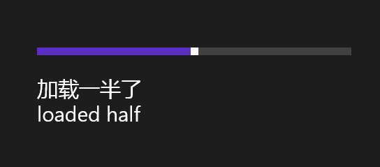

# 值转换器

有时候默认的输出方式不能满足我们的需要，比如前面的 OneWay 示例，可能我们需要的是在 TextBox 中显示“开始加载“、”加载一半了“、”很快就加载完了“以及”已经加载好“等，甚至还可以让其能够转换成英文哦。

那么首先新建一个类 SliderValueConverter.cs，然后实现 IValueConverter 接口。然后按自己的需要写它的Converter 方法即可。

```
 public class SliderNotifyAndConverter : IValueConverter      
 {
       public object Convert(object value, Type targetType, object parameter, string language)
        {
            string valueTextBlock;
            string parameterValue = parameter.ToString();
            double valueSlider = (double)value;
            if (valueSlider > 0&&valueSlider<=5)
            {
                if (parameterValue == "zh-cn")
                    valueTextBlock = "开始加载";
                else
                    valueTextBlock = "Starts to load";
            }
            else if (valueSlider >= 45 && valueSlider <= 55)
            {
                if (parameterValue == "zh-cn")
                    valueTextBlock = "加载一半了";
                else
                    valueTextBlock = "loaded half";
            }
            else if (valueSlider >= 90&&valueSlider<100)
            {
                if (parameterValue == "zh-cn")
                    valueTextBlock = " 很快就加载完了";
                else
                    valueTextBlock = "finished loading very quickly";
            }
            else if (valueSlider == 100)
            {
                if (parameterValue == "zh-cn")
                    valueTextBlock = " 已经加载好";
                else
                    valueTextBlock = "loaded";
            }
            else
            {
                if (parameterValue == "zh-cn")
                    valueTextBlock = "加载中";
                else
                    valueTextBlock = "Loading";
            }
            return valueTextBlock;
        }
        public object ConvertBack(object value, Type targetType, object parameter, string language)
        {
            throw new NotImplementedException();
        }
 }           
```

最后还需要在 XAML 中添加如下代码哦，值转换器 Converter 所使用的静态资源已经在 `<Page.Resource/>` 中定义了。另外 ConverterParameter 则是对应了后台代码中的 parameterValue 参数，通过这个属性则可以调用不同的输出，很有用哦。

```
    <Page.Resources>
        <local:SliderNotifyAndConverter x:Key="SliderNotifyAndConverterResources"/>
    </Page.Resources>
    <Grid Background="{ThemeResource ApplicationPageBackgroundThemeBrush}">
        <StackPanel Name="stackPanel" Width="450" Orientation="Vertical"
                    HorizontalAlignment="Center" VerticalAlignment="Center">
            <Slider Name="slider1" Minimum="0" Maximum="100"
                    Value="95"/>
            <TextBlock FontSize="30" 
                      Text="{Binding ElementName=slider1, Path=Value,  
                Converter={StaticResource SliderNotifyAndConverterResources}, 
                ConverterParameter='zh-cn'}"/>
            <TextBlock FontSize="30" 
                        Text="{Binding ElementName=slider1, Path=Value,  
                Converter={StaticResource SliderNotifyAndConverterResources}, 
                ConverterParameter='en-us'}"/>
        </StackPanel>
    </Grid>
```

以下是 Slider 的 Value 取不同值时 TextBlock 的不同显示。




这里仅仅是一个比较简单的示例，在项目产品中往往有数据绑定的地方都会有值转换器的，就像 C++ 中经常重载 ostream 一样。